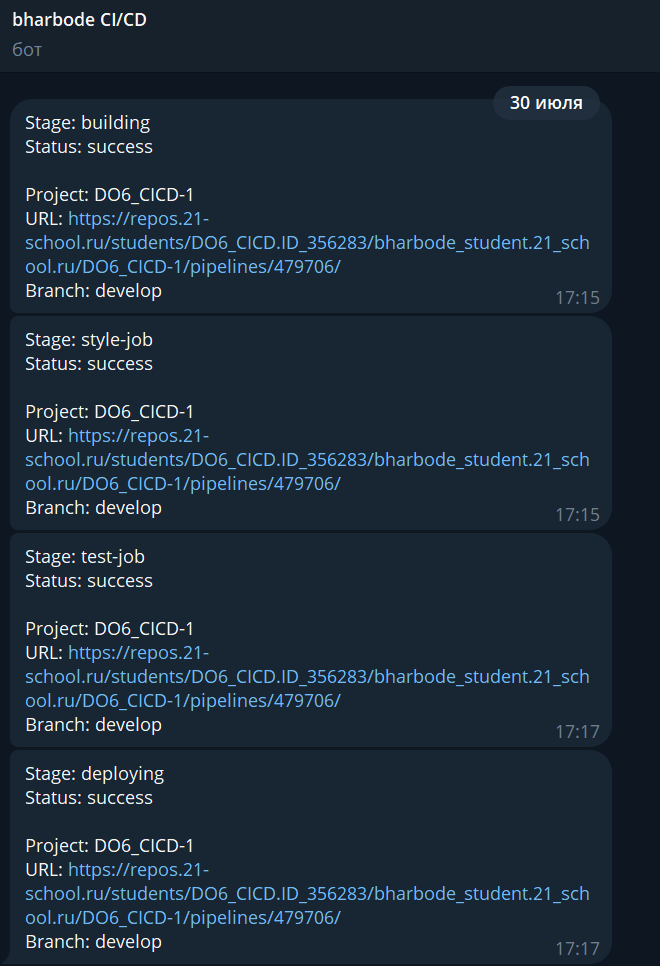

### Part 1. Настройка **gitlab-runner**

Поднять виртуальную машину Ubuntu Server 22.04 LTS

Скачать и установить на виртуальную машину gitlab-runner

    curl -L "https://packages.gitlab.com/install/repositories/runner/gitlab-runner/script.deb.sh" | sudo bash

    sudo apt-get install gitlab-runner

Запусти gitlab-runner и зарегистрировать его для использования в текущем проекте

Для регистрации понадобятся URL и токен, которые можно получить на страничке задания на платформе.

### Part 2. Сборка

Написать этап для **CI** по сборке приложений из проекта *C3_SimpleBashUtils*.

В файле _gitlab-ci.yml_ добавить этап запуска сборки через мейк файл из проекта _C3_.

Файлы, полученные после сборки (артефакты), сохранить в произвольную директорию со сроком хранения 30 дней.

### Part 3. Тест кодстайла
Написать этап для **CI**, который запускает скрипт кодстайла (*clang-format*)

Добавим ошибки по кодстайлу

### Part 4. Интеграционные тесты

Написать этап для **CI**, который запускает твои интеграционные тесты из того же проекта.

Запустить этот этап автоматически только при условии, если сборка и тест кодстайла прошли успешно.

### Part 5. Этап деплоя

Поднять вторую виртуальную машину *Ubuntu Server 22.04 LTS*.

### Part 6. Дополнительно. Уведомления

Настроить уведомления о успешном/неуспешном выполнении пайплайна через бота с именем «bharbode DO6 CI/CD» в *Telegram*.

Напишем @botfather, чтобы создать бота и получить его токен:

Добавим в конце каждого этапа такой кусок скрипта

Скрипт

